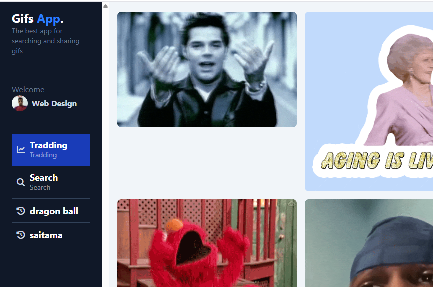
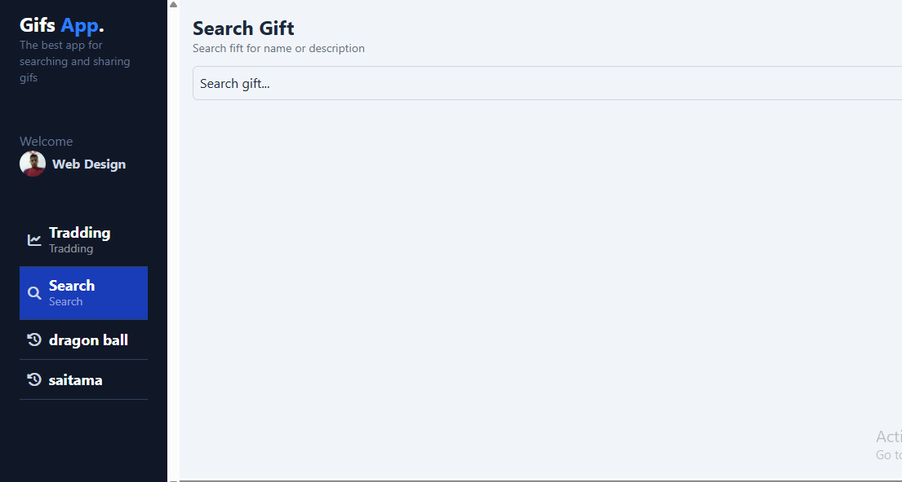
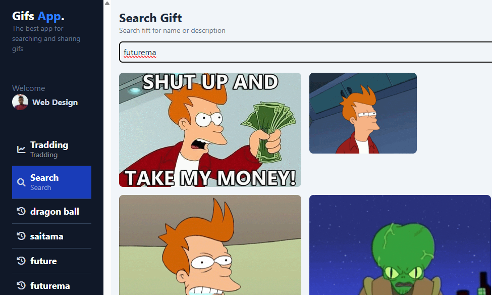
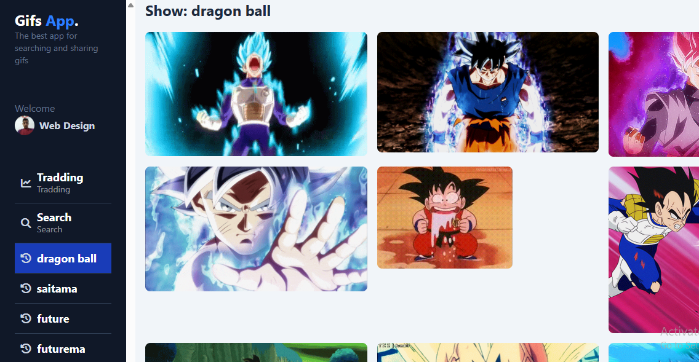
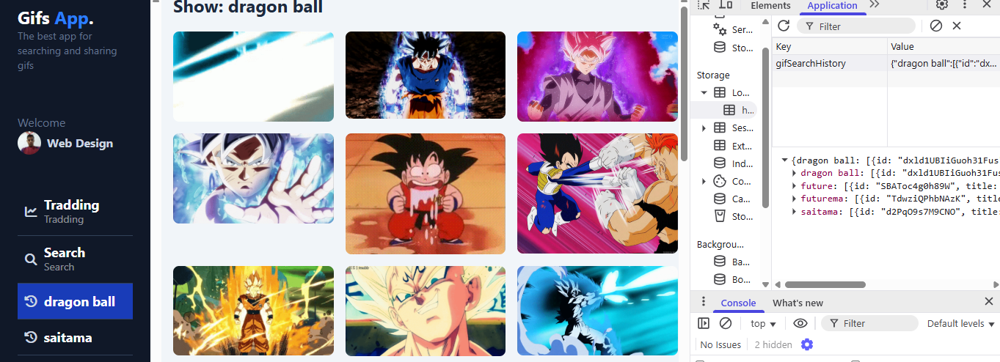

# 📘 Gif App

## 📝 Descripción
GIF search app using Angular and the Giphy API. It allows you to explore trending GIFs, perform custom searches, and save your search history using local storage.


## 🧰 Technologies used

## 🧰 Tecnologías usadas

- **Angular 20.3.6** – Framework for SPA web applications.
- **RxJS** – Reactive programming based on observables.
- **Angular Signals** – Angular's Declarative Reactivity API.
- **TailwindCSS** – Utility-first CSS Framework.
- **Giphy API** – Third-party provider for animated GIFs.


---


### 📷 Capturas











## ♻️ Reusable code


- Services
- Utility
- Mappers
- Pipes


---

## 📚 Learn

- Code of example
- Separation of reusable components and parent-to-child and child-to-parent communication 

---

## 📝 How to use this project (optional)

```bash
# Install dependency
npm install

# Start server
ng serve
